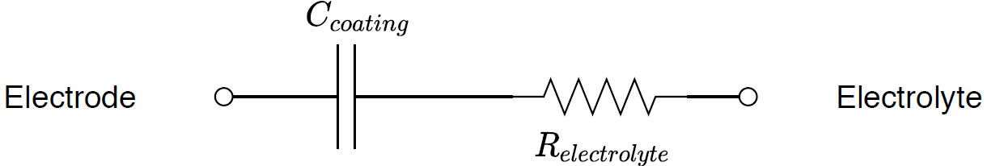
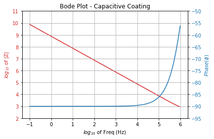
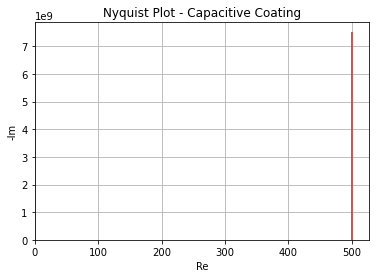
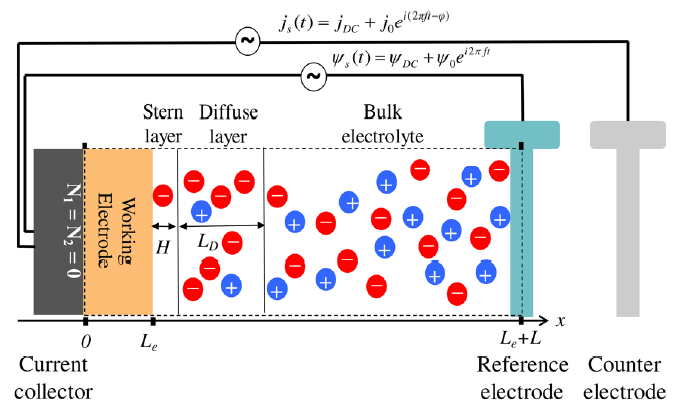
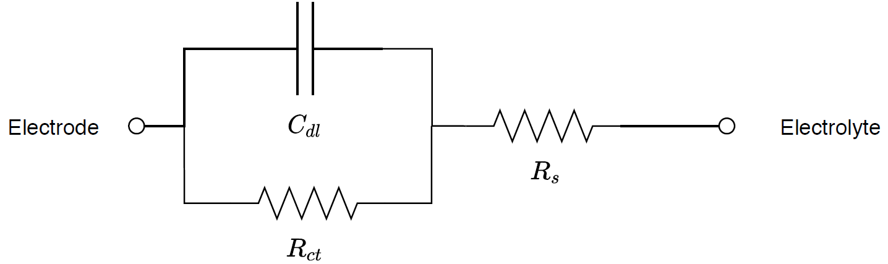
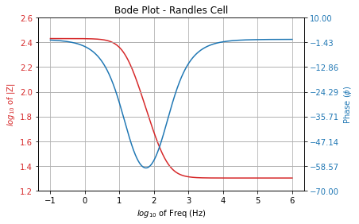
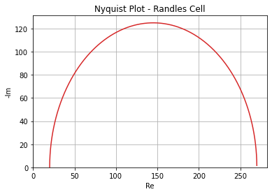

# EIS for Neural Probes
> The following scripts and modules provide electric circuit models of electrode-to-electrolyte interfaces relevant to neural interface systems.

## Intro

Electrochemical Impedance Spectroscopy (EIS) is a laboratory technique that provides impedance characterization for electrode-electrolyte interfaces. This technique allows us to model such an interface as an electric circuit consisting of lump elements. Impedance characterization is very important in the field of neural engineering as it provides valuable information of the electrical performance of a neural interface device.

For example, an electrode placed in the surface of the brain will come in contact with the cerebrospinal fluid and brain tissue. The goal is to couple the electrode to neurons to record brain activity and avoid interaction with other brain cells that might interfere in the recording. Changes in the impedance are often correlated to cell spreading and locomotion, bacterial growth and antigen-antibody reactions caused by the intrusion of a foreign object in the brain.

In this project, the module `eismodels.py` provides equivalent circuit models that have long been used to model interface impedance: Warburg elements, Randles cell, Gouy-Chapman-Stern model, and others. A combination of these models can also be obtain to characterize the performance of a neural probe under test.

## How to use

The example scripts and modules can be downloaded or cloned (if you would like to collaborate) to your local machine. Once retrieved, the `eisBasics.py` script is a good first example to become familiar with the code.

##### Eg: Purely Capacitive Coating

Given a hypothetical electrode with a coating material, the behavior appears to be purely capacitive. For a 1 $cm^2$ electrode with a 25 $\mu m$ deep coating and relative permittivity $(\varepsilon_r = 6)$ we can model the interface as a capacitor in series with the electrolyte resistance.

With this circuit model, the Bode and Nyquist plots can be obtained.

* Bode:

* Nyquist:

##### Simplified Randles Cell

A more precise model of the electrode-electrolyte interface takes into account the physical phenomena at the interface.

    Electrode-to-electrolyte interface <a href="https://pubs.acs.org/doi/full/10.1021/acs.jpcc.7b10582">1D Boundary Value Problem</a>.

As shown above, in the interface between the electrode and the electrolyte there is a double layer of charged ions, the stern and diffuse layer. Based on parameters describing this double layer, an equivalent double layer capacitance can be obtained, Cdl. In addition, we consider the chemical RedOx reaction at the interface which converts the charge carrier from electrons to ions. Given the dynamics of the RedOx reaction we can model any delay in charge exchange as a charge-tranfer resistance, Rct.

Shunting these two impedances in parallel together with the electrolyte resistance (Rs) in series, we obtain the simplified Randles Cell circuit:

With this circuit model, the Bode and Nyquist plots can be obtained.

* Bode:

* Nyquist:

## Next Steps

Neural interface devices with embedded electrodes have a more complex behavior and often dont follow one specific model, but a combination of several or with meodified elements. With on-going investigation we will add more circuit elements, such as constant phase elements, or models such as the Gouy-Chapman-Stern model to the module `eismodels.py` to add functionality.
